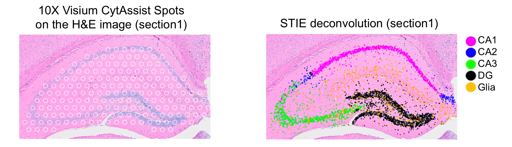
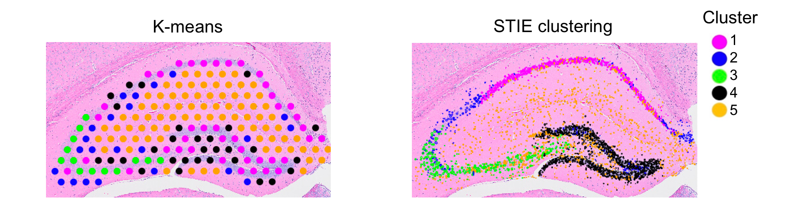
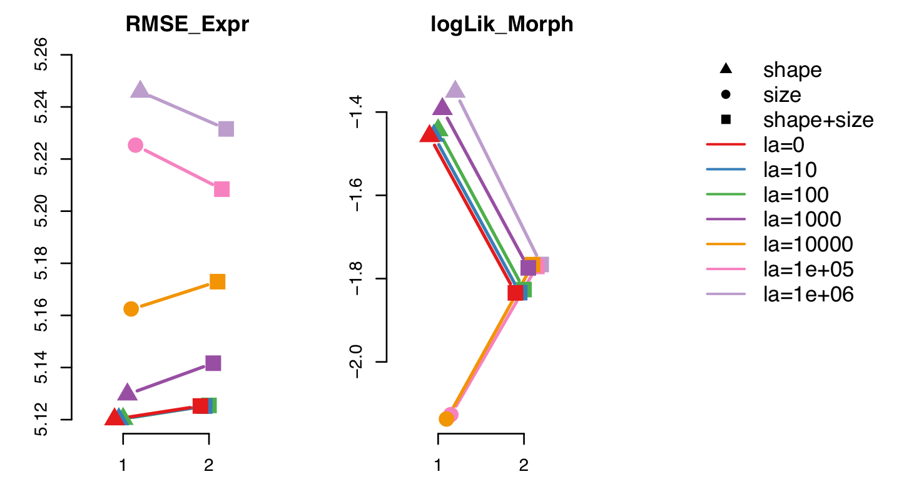

```{r setup, include = FALSE}
knitr::opts_chunk$set(
  collapse = TRUE,
  comment = "#>"
)
```

STIE aligns the spatial transcriptome data to the matched histology image-based nucleus segmentation, thereby enabling the real single-cell level and whole-slide scale deconvolution, convolution and clustering for both low- and high-resolution spots. Here, we used the 10X CytAssist mouse brain hippocampus as an example to demonstrate the STIE deconvolution and clustering at the single-cell level with and without cell-type signature. The raw data can be found from the 10X public database: [section 1](https://www.10xgenomics.com/resources/datasets/mouse-brain-coronal-section-1-ffpe-2-standard) and [section 2](https://www.10xgenomics.com/resources/datasets/mouse-brain-coronal-section-2-ffpe-2-standard).

Please refer to the wiki^[https://github.com/zhushijia/STIE/wiki] and the nucleus segmentation^[https://github.com/zhushijia/STIE/wiki/Nucleus-segmentation] for the full tutorial.

Contents:

- STIE dependent packages
- STIE input
- Single-cell level deconvolution in Spatial transcriptomics
- Single-cell level clustering in Spatial transcriptomics
- Grid search for `λ` and nuclear morphological features

## 1. Load STIE dependent tools and R packages

Here, we only import the dependent packages for STIE deconvolution and clustering, but did not import the other packages for reading raw data, plotting image, and examing cell-cell interaction. 

```{r, fig.show='hold'}
#### for the STIE package
library("STIE")

#### for the quadratic programming 
library("quadprog")

#### for manipulating ST gene expression 
# library("Seurat")

#### for manipulating images
# library("magick", "EBImage")

#### for spatially resolved cell-cell interaction
# library("CellChat", "NMF", "ggalluvial")
```

## 2. load the ST data for the 10X CytAssist mouse brain hippocampus FFPE

STIE takes the follows as input:

- `nuclear coordinates and nuclear morphology` the spatial coordinates and morphological features of the nuclei
- `spot-level gene expression` the gene expression on spots
- `cell-type transcriptomic signature` the cell-type transcriptomic signature derived from scRNA-seq data

```{r, fig.show='hold'}
STIE.dir = system.file(package = "STIE")
nn = load( paste0(STIE.dir,"/data/MouseBrainHippocampus_10xV2ChemistryCytAssistFFPE_section1n2.RData") )
nn

# spot coordiantes 
head(spot_coordinates,3)
# spot-level gene expression
head(ST_expr[,1:10],3)
# nuclear coordinates and nuclear morphology
head(morphology_fts,3)
# cell-type transcriptomic signature
head(Signature,3)
```

## 3. STIE deconvolution at single-cell level

Load mouse brain hippocampus scRNA-seq-derived cell type transcriptomic signatures. We run STIE deconvolution by setting `known_signature=TRUE` and `known_cell_types=FALSE`. We set `lambda=0` and `steps=30` for EM algorithm iteration.

```{r, fig.show='hold'}
#### Users could define the morphological features based on specific prior knowledge
#### In this example, we use "shape" as the morphological feature
features = c("shape")

#### run STIE deconvolution
system.time( result_deconv <- STIE(ST_expr, Signature, cells_on_spot, features, 
                                    lambda=0, steps=30, known_signature=TRUE, known_cell_types=FALSE))

names(result_deconv)
```

We use the `plot_sub_image()` function to overlay the single cells along with their cell types onto the image. Please run `?plot_sub_image` to check the useful visualization parameters.

The high-res images are downloaded from the 10X public database: [CytAssist_FFPE_Mouse_Brain_Rep1_tissue_image.tif](https://cf.10xgenomics.com/samples/spatial-exp/2.0.0/CytAssist_FFPE_Mouse_Brain_Rep1/CytAssist_FFPE_Mouse_Brain_Rep1_tissue_image.tif) for section 1 and [CytAssist_FFPE_Mouse_Brain_Rep2_tissue_image.tif](https://cf.10xgenomics.com/samples/spatial-exp/2.0.0/CytAssist_FFPE_Mouse_Brain_Rep2/CytAssist_FFPE_Mouse_Brain_Rep2_tissue_image.tif) for section 2.

```{r}
# library(EBImage)
# library(magick)

#### read image
# image_path = 'CytAssist_FFPE_Mouse_Brain_Rep1_tissue_image.tif'
# im <- image_read(image_path)[1]

#### the STIE-obtained cell types
# cell_types = result_deconv$cell_types

#### subset the cell contour 
# contour = cell_contour[ match(names(cell_types), names(cell_contour)) ]

#### plot the single cells along with their cell types onto the image
# colors = c("magenta", "blue", "green", "black", "orange")

# plot spot coordinates
# plot_sub_image(im=im, w=9000, h=5000, xoff=15500, yoff=11500, x_scale=0.2, spot_coordinates=spot_coordinates, contour=contour, cell_types=cell_types, color_use=colors, plot_spot=T, plot_cell=F)
```

{width=80%}


## 4. STIE clustering at single-cell level

Given no cell type transcriptomic signature, STIE can perform cell type clustering at the single-cell level, and meanwhile, estimate the gene expression signature for clusters. The initial values of clusters are first given using the spot-level clustering, e.g., K-means, Louvain clustering, or SpaGCN, the cells within the spot are assigned the same initial cluster, and the initial value of cluster signature was set to be the average gene expression of spots belonging to the cluster. In each iteration, the cluster signature was re-estimated in the M-step, and the cluster of each single cell was re-assigned in the E-step. In the following example, we take the spot-level cluster at k=5 as the initial value and run STIE with by setting `known_signature` and `known_cell_types` as `FALSE`.

```{r}
#### choose Kmeans (k=5) on spot-level gene expression
pc = prcomp(ST_expr)$x[,1:10]
set.seed(1234)
cluster = kmeans(pc,5)$cluster
cluster = data.frame( Barcode=names(cluster), Cluster=cluster )
cluster = cluster[ match( as.character(spot_coordinates$barcode), as.character(cluster$Barcode)), ]
head(cluster)

#### take the cluster average gene expression as the initial value of the cluster signature
ST_expr_ini = ST_expr[ match(as.character(cluster[,1]),rownames(ST_expr)), ]
Signature_ini = t(apply(ST_expr_ini, 2, function(x) tapply(x,cluster[,2],mean) ))

#### run STIE using "Signature_ini" as an initial value and iteratively refine "Signature" 
#### by setting both "known_signature=FALSE" and "known_cell_types=FALSE"
system.time( result_cluster <- STIE(ST_expr, Signature_ini, cells_on_spot, features, lambda=0, steps=30, 
                                    known_signature=FALSE, known_cell_types=FALSE))

```

We use the following codes to visualize the results of K-means and STIE clustering.
```{r}
#### plot the Kmeans clustering at the spot level
# colors2 = c("green", "black", "magenta", "orange", "blue")
# spot_cols = colors2[ cluster$Cluster ]
# plot_sub_image(im=im, w=9000, h=5000, xoff=15500, yoff=11500, x_scale=0.2, spot_coordinates=spot_coordinates, plot_spot=T, plot_cell=F, spot_cols=spot_cols, fill_spot=T  )

#### plot the STIE clustering at the single-cell level
#### the STIE-obtained cell types
# cell_types = result_cluster$cell_types
#### subset the cell contour 
# contour2 = cell_contour[ match(names(cell_types), names(cell_contour)) ]
#### plot the single cells along with their cell types onto the image
# plot_sub_image(im=im, w=9000, h=5000, xoff=15500, yoff=11500, x_scale=0.2, spot_coordinates=spot_coordinates, contour=contour2, cell_types=cell_types, color_use=colors2, plot_spot=F, plot_cell=T)
```

{width=80%}

## 5. Grid search for 𝝺 and nuclear morphological features
The hyperparameter `λ` balances the information from gene expression and morphological features.

- Given the predefined morphological features, we select `λ` by evaluating the balance between two criteria: RMSE of the spatial gene expression fitting and log-likelihood of the morphological feature fitting.
- To select the morphological features, under a predefined `λ`, we rank the nuclear morphological features based on the RMSE by running STIE on each feature individually. Next, based on their ranking, we used a greedy strategy to gradually add more features to the model. Like the selection of λ, the best morphological features are selected by evaluating the gene expression and morphological fittings simultaneously.
- To select the best combination of morphological features and `λ`, we investigated the morphological features over different `λ`.

In the real datasets, we extracted multiple morphological features for the nuclei. These features are found to be highly correlated, which is consistent with their definition and mathematical calculation. We focused on two large categories: size (Area, Major, Minor, Width, Height, Feret, and Perimeter) and shape (Round and Circular). To reduce the redundancy and improve efficiency, we performed PCA for each category and took the 1st PC as the surrogate of each category.

We select the best combination of the morphological feature and λ simultaneously via the grid search, which is implemented using the R function `STIE_search()`. In the mouse brain hippocampus deconvolution and clustering, the feature ‘shape’ was ranked before ‘size’, and ‘shape’ gives the lower RMSE and higher morphological likelihood at small `λ`, so we used ‘shape’ as the morphological feature and `λ=0` (red triangle).

```{r}
# searching range 
lambdas <- c(0,1e1,1e2,1e3,1e4,1e5,1e6)

# set RMSE as the criterion to rank the morphological features
# grid search for STIE deconvolution
# paths <- STIE_search(ST_expr, Signature, cells_on_spot, steps=30, known_signature=TRUE, known_cell_types=FALSE, lambdas=lambdas, criterion = "rmse" )    

# names(paths)
# names(paths[["0"]])
# paths[["0"]]$ordered_features 
```
{width=60%}
